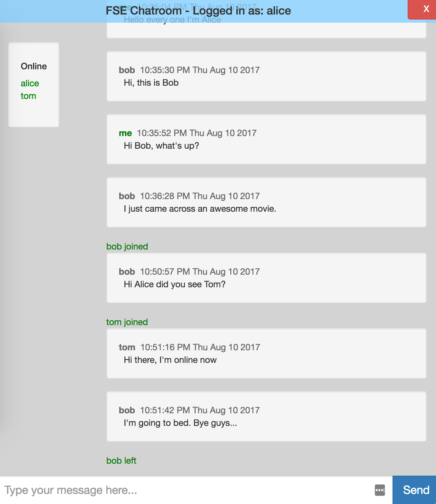

CMU FSE course assignment
------------------------------------------------

Demo Video: https://youtu.be/OIwCLHuCnzI

## Feature Overview

### Required basic features

- Register for the chat room with a new username (one that does not already exist) and password
- Enter the chat room with his/her username and password
- See other users’ chat messages
- Post a chat message
- Leave the chat room

### Required constraints

- Chat message has user name and timestamp
- Real-time dynamic updated
- Chat messages and user info should be persisted

### Bonus Features/Constraints

- Online users list
- User online/offline notice
- Same user cannot login twice
- UI: compatible with various screen sizes
- UI: auto-scroll, transparency, nav-bar style blocks

## Design

### Defined front/back end events

- `up user register` with ack: client -> server, request to register as new user
- `up user join` with ack, `up user leave`: client -> server, request to join/leave chatroom
- `down user join`, `down user leave`: server -> clients, broadcasting user join/leave events
- `up user message`: client ->server, send new message to chatroom
- `down message`: server->clients, broadcasting new messages

For example, below picture shows the interaction between client/server when a new users is trying to join the chatroom.

  

### Classes

The chatroom is abstracted as a class show in below picture.

  

## Implementation

- Frontend: bootstrap, jquery
  - Login/Register and Chatroom page are in one same html to avoid reloading. 
  - they are made visible/invisible with js depending on current status.
  - dynamically modify html content based on the data received from server
  
- Backend: node.js, express, socket.io, sqlite, promise
  - build up a web server with express
  - back-end and front-end exchange events/data via web sockets 
  - persist user info and message history with sqlite
  - use promise style programming to avoid `callback hell`

